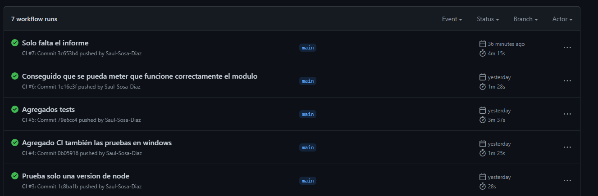
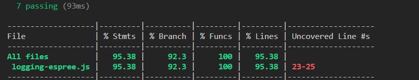
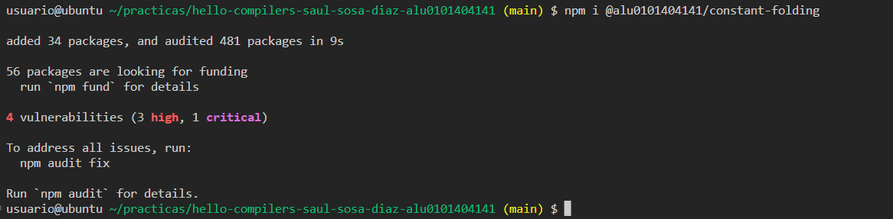
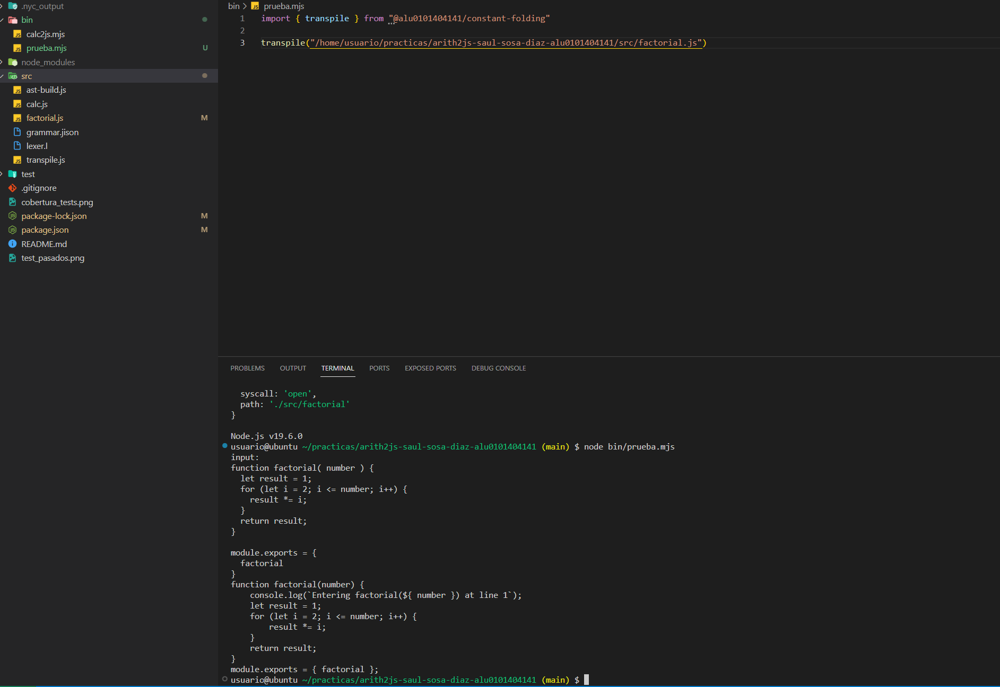

[](https://classroom.github.com/open-in-codespaces?assignment_repo_id=10291421)
# Práctica Espree logging

##Saúl Sosa Díaz
## Indicar los valores de los argumentos
Para indicar los valores de los argumentos se ha creado la siguiente función:

```js
/**
  * @brief Agrega código de registro de eventos antes del código de la función especificada en el nodo.
  * @function
  * @param {Object} node - El nodo del árbol de análisis sintáctico que contiene la función a la que se le agregará el registro de eventos.
  * @returns {void} 
  */
function addBeforeCode(node) {
  const name = node.id ? node.id.name : '<anonymous function>';
  let paramNames = '';
  if (node.params.length) {
    paramNames = "${" + node.params.map(param => param.name).join("}, ${") + "}";
  }
  const lineN = node.loc.start.line;
  const beforeCode = "console.log(`Entering " + name + "(" + paramNames + ") at line " + lineN + "`);";
  const beforeNodes = espree.parse(beforeCode, { ecmaVersion: 12 }).body;
  node.body.body = beforeNodes.concat(node.body.body);
}
```

## Opciones línea de comandos.
Para realizar este apartado se ha utilizado el paquete [comander](https://github.com/tj/commander.js#readme).  
Para poder parsear la línea de comandos únicamente hay que pegar las siguientes líneas en el código:
```js
import { program } from "commander";
import { createRequire } from "module";
const require = createRequire(import.meta.url);
const { version } = require("../package.json");
```
En estas líneas incluimos el módulo y la información de la versión que se encuentra en el *.json*.  

A continuación debemos agregar las siguientes líneas:

```js

program
  .version(version)
  .argument("<filename>", 'file with the original code')
  .option("-o, --output <filename>", "file in which to write the output")
  .action((filename, options) => {
    transpile(filename, options.output);
  });
program.parse(process.argv);
```

## Reto 1: Soportar funciones flecha
Para agregar las funciones flechas tenemos que poner la comparación de node.type === 'ArrowFunctionExpression'. **Se puede ver que soporta el mensaje de log con todas las funciones posibles.**
``` js
/**
 * Agrega registro de eventos al código proporcionado y devuelve el código modificado.
 * @function
 * @param {string} code - El código al que se le agregará el registro de eventos.
 * @returns {string} El código modificado con el registro de eventos.
 */
function addLogging(code) {
  const ast = espree.parse(code, {ecmaVersion: 12, loc: true});
  estraverse.traverse(ast, {
    enter: function (node, parent) {
      if (node.type === 'FunctionDeclaration' ||
          node.type === 'ArrowFunctionExpression' ||
          node.type === 'FunctionExpression') {
            addBeforeCode(node);
          }
    }
  })
  return escodegen.generate(ast);
}
```


## Reto 2: Añadir el número de línea
Para poder agregar los números de línea debemos agregar el parámetro loc a true, que indica la localización de la sentencia.
El siguiente código pertenece a la función anterior.
```js
const ast = espree.parse(code, {ecmaVersion: 12, loc: true});
```


## Tests and Covering
Se han agregado algunos tests muy interesantes como:
```js
//Lamadas recursivas
const a = function (n) {
  if (n === 0) {
    return 1;
  } else {
    return n*a(n-1);
  }
}
a(5);
```
```js
//Comprobar que no parsea funciones comentadas
/*
function aserejedejadeje() {
  return "Las ketchup"
}
*/
function main() {
  a = 1 + 1;
}
```
```js
// Comprobar que no pilla funciones en strings
let a = "function aserejedejadeje => {return \"Las ketchup\"}"
function main() {
  a = 1 + 1;
}
```

Para el apartado de integración continua se ha utilizado [github actions](https://docs.github.com/es/actions)
Para ello debemos tener una carpeta *.github* en nuestro repositorio, y dentro de ella una carpeta llamada *workflows*. 
Aquí implementaremos un fichero *.yml* que tendrá el siguiente contenido.
```yaml
# Write your workflow for CI here
name: CI

# Controls when the workflow will run
on:
  # Triggers the workflow on push or pull request events but only for the $default-branch branch
  push:
    branches: [ main ]
      
  pull_request:
    branches: [ main ]
  # Allows you to run this workflow manually from the Actions tab
  workflow_dispatch:

# A workflow run is made up of one or more jobs that can run sequentially or in parallel
jobs:
  # This workflow contains a single job called "build"
  build:
    # The type of runner that the job will run on
    runs-on: ${{ matrix.os }}
    strategy:
      matrix:
        os:
          - ubuntu-latest
          - macos-latest
          - windows-latest
        node_version: [ 16.x]
        architecture:
          - x64

    name: Node ${{ matrix.node_version }} - ${{ matrix.architecture }} on ${{ matrix.os }}
    steps:
      # Checks-out your repository under $GITHUB_WORKSPACE, so your job can access it
      - uses: actions/checkout@v2 
      - name: setup node
        uses: actions/setup-node@v3
        with:
          node-version: ${{ matrix.node_version }}
          architecture: ${{ matrix.architecture }}
      - run: npm ci
      - run: npm test
```
*Este script se ejecuta cuando hay un push o una pull request en la rama main.*

Una muestra de la ejecución de este script:


Se ha utilizado la herramienta c8 porque nyc no soporta los modulos ES.


## Librería npm.
Se ha publicado correctamente la librería en npm en el siguiente [enlace](https://www.npmjs.com/package/@alu0101404141/constant-folding).

Se ha probado en el directorio de la práctica anterior que se ha podido instalar y funciona correctamente.



## Documentación.
Para la documentación del código se han utilizado comentarios estilo [JSDoc](https://ull-esit-gradoii-pl.github.io/temas/introduccion-a-javascript/documentation.html#jsdoc).
Y se ha utilizado la herramienta [jsdoc-to-markdown](https://github.com/jsdoc2md/jsdoc-to-markdown) para la creación de un readme automático que se encuentra en la carpeta */doc*.

## Scripts del programa.

En el fichero package.json se han incluido scripts para la ejecución del programa: 

```
"test": "mocha test/test.mjs",
"exe": "node bin/log.js",
"cov": "c8 npm run test"
```